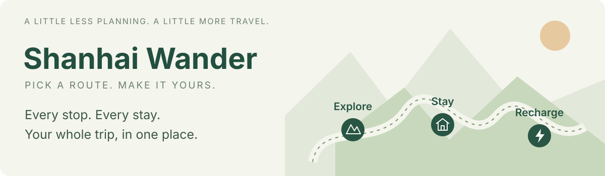
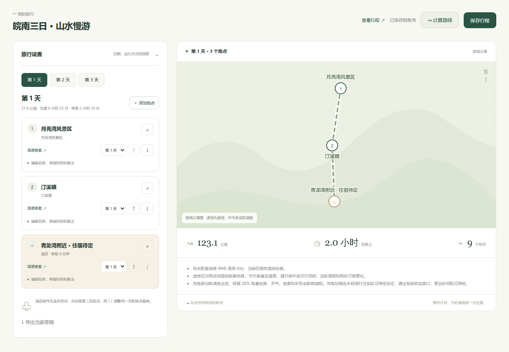
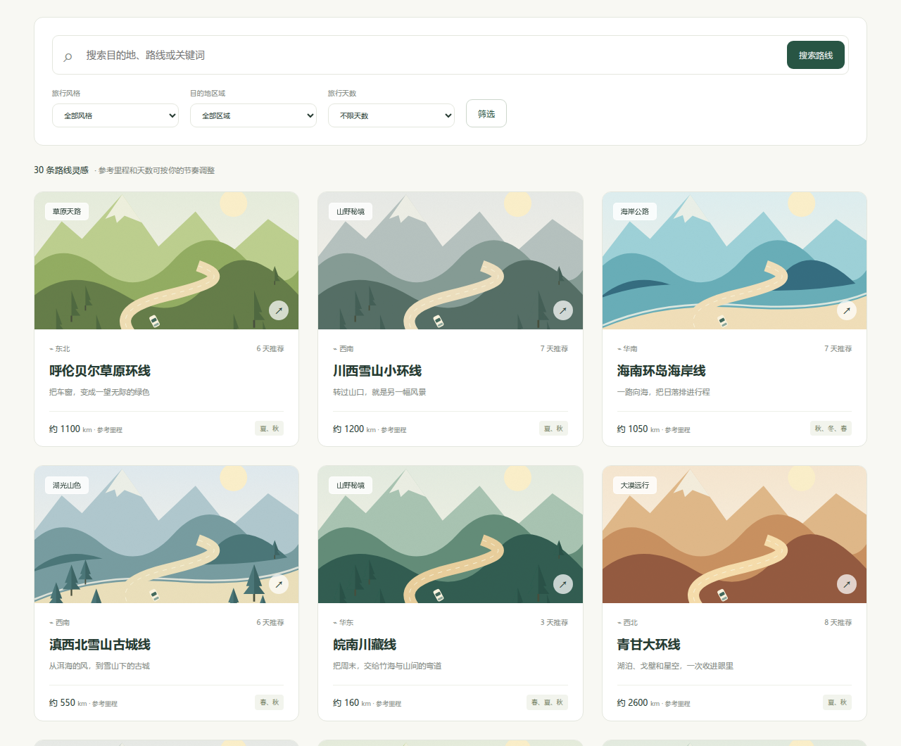
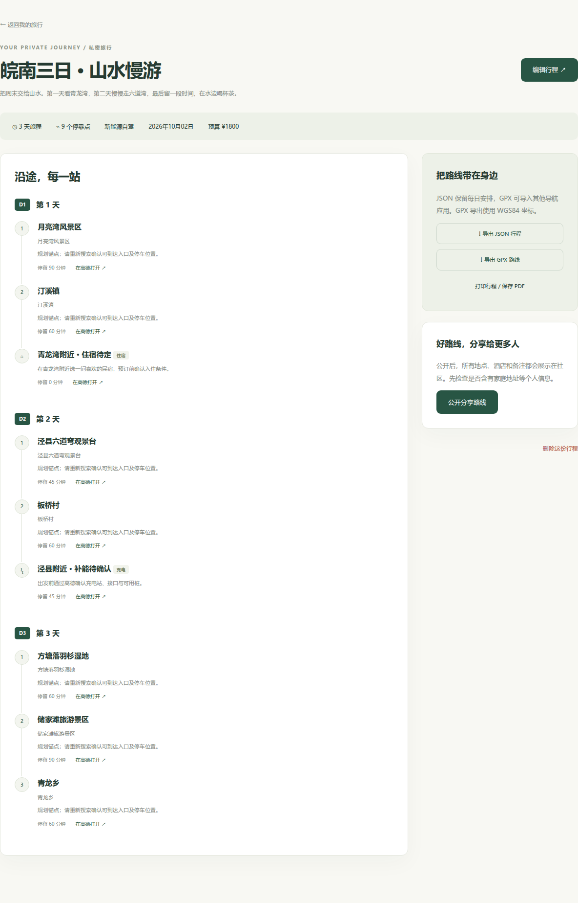

<p align="center">
  
</p>

<p align="center">
  <a href="./pyproject.toml"></a>
  <a href="https://www.python.org/"></a>
  <a href="https://www.djangoproject.com/"></a>
  <a href="#get-started"></a>
  <a href="https://github.com/mituan-ai/shanhai-wander/actions/workflows/ci.yml"></a>
  <a href="./LICENSE"></a>
</p>

<p align="center">
  <a href="./README.md">简体中文</a> · <strong>English</strong><br>
  <a href="#get-started">Get started</a> · <a href="./docs/setup.en.md#enable-amap">Enable maps</a> · <a href="./docs/setup.en.md#deploy-on-a-server">Deploy</a> · <a href="https://github.com/mituan-ai/shanhai-wander/issues">Report an issue</a>
</p>

**Pick a route. Arrange the sights, hotels and charging stops by day.** Shanhai Wander helps you save, adjust and share trips across China, whether you drive, take an EV, cycle or walk. The app interface is currently in Chinese.

<p align="center">
  
</p>

## Room for every part of your trip

| | What you can do |
| --- | --- |
| 🗺️ **Find inspiration** | Choose from 30 classic routes. Filter by region, duration or travel style. |
| 📍 **Arrange your stops** | Add places, reorder them, set a stop duration or move a place to another day. |
| 🛏️ **Plan overnight stays** | Add a hotel and continue the following day's journey from there. |
| ⚡ **Plan charging stops** | Enter your EV range, check charging reminders and add nearby stations. |
| 🔒 **Keep your plans** | Create an account and save privately. Publish to the community when you choose. |
| 📤 **Take it with you** | Import or export JSON / GPX, or print the itinerary and save it as a PDF. |

<p align="center">
  
</p>

## Get started

Install [Docker](https://docs.docker.com/get-started/get-docker/) and [Git](https://git-scm.com/downloads), open a terminal, then run:

```bash
git clone https://github.com/mituan-ai/shanhai-wander.git
cd shanhai-wander
cp .env.example .env
docker compose up -d --build
```

Open **[http://localhost:8000](http://localhost:8000)** → create an account → choose a route → start planning.

> [!TIP]
> The first launch downloads dependencies, so give it a moment. These commands also work in Windows PowerShell.

<p align="center">
  
</p>

## Enable maps, hotels and charging searches

Create credentials on the [AMap developer platform](https://lbs.amap.com/), then add all three values to the project's `.env` file:

```dotenv
AMAP_WEB_KEY=your_web_service_key
AMAP_JS_KEY=your_web_js_key
AMAP_JS_SECURITY_CODE=your_js_security_code
```

Save the file and run:

```bash
docker compose up -d --force-recreate app
```

> [!NOTE]
> Without keys, you can still browse, edit, save and share trips. The map is a route sketch and distances are straight-line estimates. Configure AMap to look up actual roads, hotels and charging stations. [Setup guide →](./docs/setup.en.md#enable-amap)

Hotels are itinerary stops, not bookings. Confirm charger availability, connectors and opening hours before you travel.

## Keep it private, or share the journey

<p align="center">
  
</p>

> [!TIP]
> New and imported trips are private. Open a trip and choose **公开分享路线** to publish it. Check hotel details, dates and notes for personal information first.

## Run your own travel planner

Accounts and trips live in a local database, stored in a persistent Docker volume. Add a domain and HTTPS to let friends use your instance too.

| Need a hand? | Open this guide |
| --- | --- |
| 🌐 Deploy with a domain and HTTPS | [Server setup](./docs/setup.en.md#deploy-on-a-server) |
| 💾 Back up or restore your trips | [Backup and recovery](./docs/setup.en.md#back-up-your-trips) |
| 🔑 Configure maps or troubleshoot search | [AMap setup](./docs/setup.en.md#enable-amap) |
| 🧭 Add a route or improve the app | [Contributing](./CONTRIBUTING.md) |

> [!IMPORTANT]
> `docker compose down` keeps your trips. **Do not add `-v`**: that deletes the data volume. Back up important journeys regularly.

---

<p align="center">
  <strong>Your next journey starts here.</strong><br>
  <a href="https://github.com/mituan-ai/shanhai-wander/issues">Ideas &amp; feedback</a> · <a href="./DATA_SOURCES.md">Route sources</a> · <a href="./LICENSE">MIT License</a>
</p>
